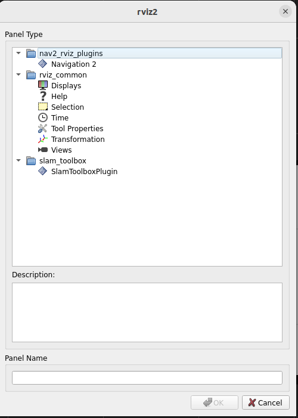
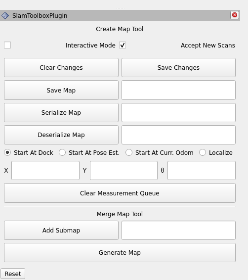

# Mirte with PDDL

During this exercise, you will learn how to use [PDDL](https://planning.wiki/guide/whatis/pddl) with [PlanSys2](https://plansys2.github.io/) to make Mirte navigate using [nav2](https://docs.nav2.org/).

Before we start digging in the PDDL formulation and PlanSys2, first we need to create a map of the arena to enable the robot to navigate autonomously. 

[Video of Mirte moving around with PlanSys2](https://www.youtube.com/shorts/LW3ei5E4KZw)

```{note}
All the commands below should be executed inside a docker container of the `mirte_playground` image. Check the [Use Mirte with Docker](https://kas-lab.github.io/mirte_playground/docker.html) page for detailed instructions on how to download and run the image.
```

## Mapping

Place Mirte inside the arena, preferably close to the middle to make it easier for Mirte to move.

### Start the mapping stack

Start the navigation stack:
```Bash
ros2 launch mirte_navigation real_robot_navigation.launch.py
```

In another terminal, start the slam toolbox:
```Bash
ros2 launch slam_toolbox online_async_launch.py use_sim_time:=false
```

### Make Mirte navigate

To make Mirte navigate, click on the `Nav2 Goal` button on the top part of the RVIZ screen then click on a point in the map to make it move there.


Make Mirte move around until it maps the whole arena. When you are satisfied with the map created, move to the next step.

### Save map

To save the map you just created, first you need to add the SlamToolboxPlugin to RVIZ. For that, on the top left part of RVIZ, click on `Panels` > `Add new panel` > `SlamToolBoxPlugin`:



After adding the panel, it should show up in the bottom left part of RVIZ



Insert the following path in the field in front of the `Save Map` button and click on the button:

```
/home/ubuntu-user/mirte_ws/src/mirte_navigation/maps/arena_map
```

## PlanSys2

For this exercise, we designed a very simple scenario where Mirte should move through 3 waypoints and return to the initial position.

### PDDL

The first thing you need to do is to modify the [domain.pddl](https://github.com/kas-lab/mirte_playground/blob/main/mirte_pddl/pddl/domain.pddl) and [problem.pddl](https://github.com/kas-lab/mirte_playground/blob/main/mirte_pddl/pddl/problem.pddl) files to model the scenario described above.

```{note}
Tip: make sure you model which points were already visited and modify the action preconditions to use this knowledge. Also, make sure the action effects properly model the location of the robot, and its impact on the visisted waypoints knowledge.
```

### Waypoints configuration

Update the [waypoints.yml](https://github.com/kas-lab/mirte_playground/blob/main/mirte_pddl/config/waypoints.yml) configuration file with coordinates that make sense for your map. 
To obtain the coordinates of points in the map, you can click on the `Publish Point` button on the top part of RVIZ and subscribe to the `/clicked_point` topic to obtain the coordinates.

```Bash
ros2 topic echo /clicked_point
```

### Adding more waypoints

If you want to add more waypoints, in addition to adding them to the [waypoints.yml](https://github.com/kas-lab/mirte_playground/blob/main/mirte_pddl/config/waypoints.yml) file, you need to declare the new waypoints in the [move action](https://github.com/kas-lab/mirte_playground/blob/fcb49fa21600141758ce2ff98e6cbc59564cc44c/mirte_pddl/src/action_move.cpp#L49-L52).

### Run PlanSys with Mirte

**First, connect to Mirte.**

In your computer, inside the docker container, start the navigation stack:
```Bash
ros2 launch mirte_navigation real_robot_navigation.launch.py
```

In another terminal, start PlanSys2:
```Bash
ros2 launch mirte_pddl mirte_pddl.launch.py
```

```{note}
Sometimes PlanSys2 crashes when starting, so give it another try in case it doesn't work in the first try.
```

