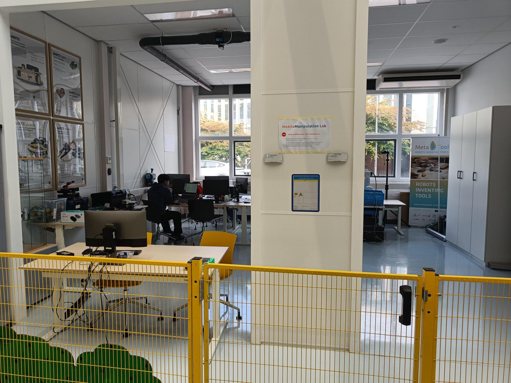

.. mirte_playground documentation master file, created by
   sphinx-quickstart on Fri Jun 27 11:08:55 2025.
   You can adapt this file completely to your liking, but it should at least
   contain the root `toctree` directive.

==============================================================
R2S section - Safety Manual
==============================================================
Department of Cognitive Robotics, TU Delft
(For both staff and students)

This is the Safety Manual of the Robust Robot Systems section of teh Cognitive Robotics Department, Faculty Mechanical Engineering, TU Delft.

.. _fig-robot:

0. Background Information
-------------------------
This manual applies to all lab spaces of the R2S, currently:

- Mobile Manipulation Lab
  - Location: 34.F-0-450
  - Contact: Carlos Hernandez Corbato
- AgriFood Lab
  - Location: RoboHouse
  - Contact: Chris Pek

1. General Conduct
------------------
- **Access:** Only authorized lab members may enter and operate equipment. Visitors must be accompanied.
- **Work hours:** Do not work alone outside regular hours (09:00–18:00).
- **Awareness:** Always be alert to the position and motion of robots. Avoid distractions (headphones, phone use) when robots are active.
- **Workspace:** Keep the 10×10 m area uncluttered. Do not block robot pathways or emergency exits.

2. Robot Operation
------------------
Tiago++ Mobile Manipulator & Clearpath Boxer + Franka Arm

.. list-table::
   :widths: 50 50
   :align: center

   * - .. figure:: _static/Albert.jpeg
          :alt: First image
          :width: 100%

          Albert robot(Franka Arm + Clearpath Boxer)
     - .. figure:: _static/Tiago.jpeg
          :alt: Second image
          :width: 100%

          Tiago++ Mobile Manipulator
         
The manual of Albert can be found here:

- **Training required:** Only trained users may operate robots.
- **Powering on/off:** Follow official startup/shutdown procedures. Never hot-plug cables.
- **Operating zone:** Maintain a **2 m safety distance** around robots when active.
- **Emergency stop (E-Stop):**
  - Know the location of the robot’s hardware E-Stop buttons and wireless controller.
  - Press immediately if motion is unsafe or unexpected.
- **Speed limits:** Use reduced speed during experiments involving humans.
- **Supervision:** Robots must never run unattended.

3. Personal Safety
------------------
- **Clothing:** No loose clothing, scarves, jewelry, or dangling items near robots.
- **Hair:** Tie back long hair.
- **Protective gear:** Safety glasses are recommended when testing manipulation tasks involving objects.
- **Manual handling:** Do not manually force robot joints or wheels unless explicitly trained to do so.

4. Environment & Equipment
--------------------------
- **Desks:** Use designated desks for laptops and coding. Do not place food or drinks near robots or electronics.
- **Cables:** Route cables along walls or tape them down to prevent tripping.
- **Storage:** Keep tools, objects, and test items in designated shelves or bins.
- **Battery & charging:**
  - Charge robots only at approved stations.
  - Do not leave charging robots unattended overnight.

5. Emergencies
--------------
- **Emergency stops:** Press immediately if there is any risk to people or equipment.
- **Fire safety:** Know the nearest fire extinguisher and evacuation route. Do not use robots during evacuation.
- **Injury:** Report all injuries, even minor ones, to the lab supervisor.
- **Incident reporting:** Any accident, near-miss, or equipment damage must be documented and reported.

6. Responsibility
-----------------
Lab members are responsible for:

- Following this safety manual.
- Respecting shared equipment and workspace.
- Keeping the lab a safe and collaborative environment.

**Failure to comply may result in suspension of lab access.**

Key Rule of Thumb
-----------------
If in doubt, stop the robot and ask a supervisor.

.. toctree::
   :includehidden:
   :hidden:
   
   SE-Robotics Summer Schools <self>
   contact

.. toctree::
   :caption: Editions:
   :maxdepth: 1

.. SE-Robotics Summer School 20XX <20XX/index>

License
-------

The project is licensed under the Apache 2.0 license

